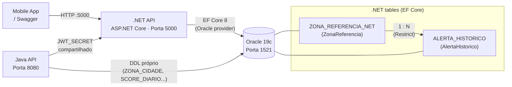

# Pulso Urbano — .NET API

API secundária do sistema Pulso Urbano, responsável pelo histórico de alertas de qualidade do ar e estatísticas agregadas por zona de São Paulo.

**Global Solution 2026/1 · FIAP · ADS 2º ano**

---

## Visão Geral

Esta API gerencia o ciclo de vida de **AlertaHistórico** — registros de eventos de qualidade do ar crítica em zonas monitoradas da cidade. Ela **não** calcula scores, não ingere dados de satélite e não emite tokens JWT; essas responsabilidades pertencem à API Java (porta 8080). O JWT emitido pelo Java é validado aqui via segredo compartilhado (`JWT_SECRET`).

Domínio exclusivo do .NET:
- CRUD completo de `AlertaHistorico` (1:N com `ZonaReferencia`)
- Estatísticas agregadas por zona (score médio, tendência, dias críticos)
- Resumo global dos últimos 30 dias
- EF Core Migrations (prova de migração para o critério da disciplina)

---

## Arquitetura



> A FK entre `ZonaReferencia` e `AlertaHistorico` usa `DeleteBehavior.Restrict`: deletar uma zona que ainda possui alertas retorna **409 Conflict**.

---

## Stack

| Componente | Versão |
|---|---|
| ASP.NET Core | .NET 10 (net10.0) |
| Entity Framework Core | 8.x |
| Oracle.EntityFrameworkCore | 8.23.x |
| Swashbuckle.AspNetCore | 6.6.x |
| FluentValidation.AspNetCore | 11.x |
| System.IdentityModel.Tokens.Jwt | 8.x |
| xUnit + FluentAssertions | 2.x / 6.x |
| SQLite (testes) | via EF Core Sqlite 8.x |

---

## Endpoints

| Método | Rota | Auth | Resposta |
|--------|------|------|----------|
| `POST` | `/api/alertas` | Bearer | 201 `AlertaResponseDTO` |
| `GET` | `/api/alertas?zonaId=&dias=30&pagina=1&tamanhoPagina=20` | Público | 200 `PaginatedResponseDTO<AlertaResponseDTO>` |
| `GET` | `/api/alertas/{id}` | Público | 200 / 404 |
| `PUT` | `/api/alertas/{id}/confirmar` | Bearer | 200 / 404 |
| `DELETE` | `/api/alertas/{id}` | Bearer | 204 / 404 |
| `GET` | `/api/estatisticas/zona/{zonaId}?dias=30` | Público | 200 `EstatisticasZonaDTO` |
| `GET` | `/api/estatisticas/resumo` | Público | 200 `EstatisticasResumoDTO` |
| `GET` | `/api/health` | Público | 200 `HealthResponseDTO` |

Valores válidos para `nivelAlerta`: `ATENCAO`, `ALERTA`, `EMERGENCIA`.

Documentação interativa completa: `http://localhost:5000/swagger`

---

## Como rodar

### Opção 1 — Docker (recomendado para demo)

```bash
git clone <url-do-repo> && cd pulso-dotnet
cp .env.example .env          # ajuste DB_HOST=oracle e JWT_SECRET conforme compose
docker build -t pulso-dotnet:gs .
docker run --rm --env-file .env -p 5000:5000 pulso-dotnet:gs
curl http://localhost:5000/api/health
# Swagger: http://localhost:5000/swagger
```

> Para subir o stack completo (Oracle + Java + .NET), use o `docker-compose.yml` do monorepo (dono: Clayton).

### Opção 2 — Desenvolvimento local (dotnet run)

**Pré-requisitos:** .NET 10 SDK, Oracle 19c acessível, `dotnet-ef` global.

```bash
git clone <url-do-repo> && cd pulso-dotnet
cp .env.example .env          # ajuste DB_HOST=localhost
# exporte as variáveis de ambiente (PowerShell):
$env:DB_USER="system"; $env:DB_PASS="oracle"; $env:DB_HOST="localhost"
$env:DB_PORT="1521"; $env:DB_SERVICE="XEPDB1"
$env:JWT_SECRET="<mesmo valor do Java>"
$env:ASPNETCORE_ENVIRONMENT="Development"

dotnet ef database update --project PulsoUrbano.Net   # aplica migrations + seed automático
dotnet run --project PulsoUrbano.Net
# Swagger: http://localhost:5000/swagger
```

---

## Migrations

```bash
# Instalar ferramenta global (uma vez)
dotnet tool install --global dotnet-ef --version 8.*

# Aplicar migrations existentes no Oracle
dotnet ef database update --project PulsoUrbano.Net

# Verificar estado
dotnet ef migrations list --project PulsoUrbano.Net
# → InitialCreate (Applied)

# Adicionar nova migration (após alterar entidade)
dotnet ef migrations add NomeDaMigracao --project PulsoUrbano.Net --output-dir Data/Migrations
dotnet ef database update --project PulsoUrbano.Net
```

> Em ambiente `Development` o app executa `Database.Migrate()` e `DataSeeder.SeedAsync()` automaticamente no boot (5 zonas + 40+ alertas de demonstração).

---

## Testes

Os testes rodam sobre **SQLite in-memory** — Oracle não é necessário.

```bash
# Todos os testes
dotnet test tests/PulsoUrbano.Net.Tests

# Apenas integração (WebApplicationFactory)
dotnet test tests/PulsoUrbano.Net.Tests --filter "FullyQualifiedName~Integration"

# Classe específica
dotnet test tests/PulsoUrbano.Net.Tests --filter "FullyQualifiedName~AlertaServiceTests"
```

Saída esperada:

```
Test run for PulsoUrbano.Net.Tests.dll
Passed! - Failed: 0, Passed: XX, Skipped: 0
```

Cobertura de testes:

| Camada | Arquivo de teste |
|---|---|
| Seeder | `Data/DataSeederTests.cs` |
| DTO Validator | `DTOs/AlertaCreateDTOValidatorTests.cs` |
| JWT Middleware | `Middleware/JwtValidationMiddlewareTests.cs` |
| Exception Middleware | `Exceptions/GlobalExceptionMiddlewareTests.cs` |
| AlertaService | `Services/AlertaServiceTests.cs` |
| EstatisticasService | `Services/EstatisticasServiceTests.cs` |
| HealthController | `Controllers/HealthControllerTests.cs` |
| AlertaController (integração) | `Integration/AlertaControllerTests.cs` |
| EstatisticasController (integração) | `Integration/EstatisticasControllerTests.cs` |
| Migration smoke test | `Integration/MigrationSmokeTests.cs` |

---

## Exemplos de Teste de Endpoint

Substitua `$TOKEN` pelo JWT emitido pela API Java (`POST /api/v1/auth/login`).

### Criar alerta (Bearer obrigatório)

```bash
curl -s -X POST http://localhost:5000/api/alertas \
  -H "Content-Type: application/json" \
  -H "Authorization: Bearer $TOKEN" \
  -d '{
    "zonaId": 1,
    "nivelAlerta": "ALERTA",
    "scoreRegistrado": 38.5,
    "no2Registrado": 41.2,
    "textoRecomendacao": "Evite esforço físico ao ar livre entre 11h e 16h."
  }'
# → 201 Created  { "id": 42, "zonaNome": "Centro", "nivelAlerta": "ALERTA", ... }
```

### Listar alertas (público)

```bash
curl -s "http://localhost:5000/api/alertas?zonaId=1&dias=30&pagina=1&tamanhoPagina=5"
# → 200 { "total": 12, "pagina": 1, "tamanhoPagina": 5, "dados": [...] }
```

### Buscar alerta por ID

```bash
curl -s http://localhost:5000/api/alertas/1
# → 200 { "id": 1, "zonaNome": "Centro", ... }
# ID inexistente → 404 { "status": 404, "erro": "Não encontrado" }
```

### Confirmar alerta (Bearer obrigatório)

```bash
curl -s -X PUT http://localhost:5000/api/alertas/1/confirmar \
  -H "Content-Type: application/json" \
  -H "Authorization: Bearer $TOKEN" \
  -d '{"confirmado": true}'
# → 200 { "confirmado": true, ... }
```

### Deletar alerta (Bearer obrigatório)

```bash
curl -s -X DELETE http://localhost:5000/api/alertas/1 \
  -H "Authorization: Bearer $TOKEN"
# → 204 No Content
```

### Estatísticas por zona

```bash
curl -s "http://localhost:5000/api/estatisticas/zona/1?dias=30"
# → 200 {
#      "zonaId": 1, "zonaNome": "Centro",
#      "totalAlertas": 12, "alertasPorNivel": {"ATENCAO":5,"ALERTA":5,"EMERGENCIA":2},
#      "scoreMinimo": 22.1, "scoreMaximo": 78.4, "scoreMedia": 51.3,
#      "diasComAlerta": 8, "piorDia": "2026-05-15T...",
#      "tendencia": "ESTAVEL"
#    }
```

### Resumo geral

```bash
curl -s http://localhost:5000/api/estatisticas/resumo
# → 200 {
#      "totalZonas": 5, "totalAlertas30dias": 47,
#      "zonaComMaisAlertas": { "id": 1, "nome": "Centro", "total": 15 },
#      "nivelPredominante": "ALERTA",
#      "dtAtualizacao": "2026-06-06T..."
#    }
```

### Health check

```bash
curl -s http://localhost:5000/api/health
# → 200 { "status": "healthy", "servico": "pulso-urbano-dotnet", "versao": "1.0.0",
#          "timestamp": "...", "database": "connected" }
```

---

## Vídeo Pitch (3 min)

> Link a ser adicionado por Felipe após a gravação.
> <!-- TODO: inserir URL do pitch aqui -->

---

## Equipe

| Membro | RM | Responsabilidade |
|---|---|---|
| Felipe Ferrete | 562999 | Tech lead · Backend .NET (este repositório) |
| Clayton | — | Oracle DDL · Docker Compose · DevOps |
| Guilherme | — | Mobile React Native |
| Bosak | — | Arquitetura · QA |
| Brisola | — | IoT ESP32 / Wokwi |
