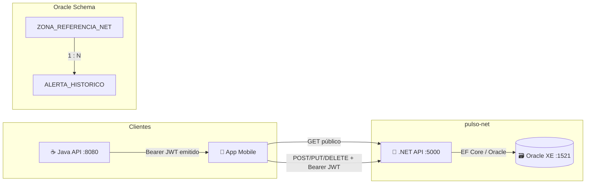

# Pulso Urbano — API .NET

API secundária do projeto **Pulso Urbano** (Global Solution 2026/1 · FIAP · ADS 2º ano).  
Responsável por: histórico de alertas ambientais por zona de São Paulo e estatísticas de qualidade do ar derivadas de dados orbitais (Sentinel-5P/TROPOMI, ECOSTRESS).

> **Fronteira com a Java API:** a Java API autentica usuários, consome as fontes orbitais (Copernicus, NASA) e emite o score de risco. Esta API .NET armazena o **histórico** desses alertas e expõe estatísticas agregadas para o app mobile. Nenhuma chamada cross-API existe em runtime — a integração é via banco Oracle compartilhado e JWT compartilhado.

---

## Arquitetura



**Fluxo de dados:**  
Sentinel-5P → Java API → score CRITICO → `POST /api/alertas` (Bearer) → Oracle → `GET /api/alertas` (mobile)

---

## Stack

| Camada | Tecnologia |
|---|---|
| Runtime | .NET 10 / ASP.NET Core 10 |
| ORM | Entity Framework Core 8 + Oracle.EntityFrameworkCore 8.23 |
| Banco | Oracle XE 21c (container `gvenzl/oracle-xe:21-slim`) |
| Docs | Swashbuckle (OpenAPI 3) |
| Validação | FluentValidation 11 |
| Auth | JWT (HMAC-SHA256) via middleware customizado |
| Testes | xUnit + WebApplicationFactory + SQLite in-memory |
| Container | Docker (multi-stage, Alpine, usuário não-root) |

---

## Endpoints

| Verbo | Rota | Auth | Descrição |
|---|---|---|---|
| `POST` | `/api/alertas` | Bearer | Registra alerta histórico |
| `GET` | `/api/alertas` | Público | Lista alertas paginados (`zonaId`, `dias`, `pagina`, `tamanhoPagina`) |
| `GET` | `/api/alertas/{id}` | Público | Busca alerta por ID |
| `PUT` | `/api/alertas/{id}/confirmar` | Bearer | Confirma ou reverte confirmação |
| `DELETE` | `/api/alertas/{id}` | Bearer | Remove alerta (hard delete, 204) |
| `GET` | `/api/estatisticas/zona/{zonaId}` | Público | Estatísticas da zona (`dias`) |
| `GET` | `/api/estatisticas/resumo` | Público | Resumo geral dos últimos 30 dias |
| `GET` | `/api/health` | Público | Health check + ping Oracle |

### Contratos resumidos

**POST /api/alertas** — body:
```json
{
  "zonaId": 1,
  "nivelAlerta": "ALERTA",
  "scoreRegistrado": 72.5,
  "no2Registrado": 38.1,
  "textoRecomendacao": "Evite atividades ao ar livre prolongadas."
}
```
Resposta `201 Created`:
```json
{
  "id": 42,
  "zonaId": 1,
  "zonaNome": "Centro",
  "nivelAlerta": "ALERTA",
  "scoreRegistrado": 72.5,
  "no2Registrado": 38.1,
  "textoRecomendacao": "Evite atividades ao ar livre prolongadas.",
  "dtAlerta": "2026-05-30T14:00:00Z",
  "confirmado": false
}
```

**GET /api/estatisticas/zona/1** — resposta `200 OK`:
```json
{
  "zonaId": 1,
  "zonaNome": "Centro",
  "periodo": { "dias": 30, "inicio": "2026-04-30", "fim": "2026-05-30" },
  "totalAlertas": 12,
  "alertasPorNivel": { "ATENCAO": 5, "ALERTA": 6, "EMERGENCIA": 1 },
  "scoreMinimo": 45.0,
  "scoreMaximo": 91.3,
  "scoreMedia": 67.8,
  "diasComAlerta": 9,
  "piorDia": "2026-05-18",
  "tendencia": "PIORANDO"
}
```

---

## Como rodar

### Opção A — Docker (recomendado para demo)

Pré-requisito: Docker Engine + Compose v2.

```bash
git clone <URL_DO_REPO> && cd pulso-dotnet

# 1. Copie e ajuste as variáveis de ambiente
cp .env.example .env
# Edite JWT_SECRET para igualar ao da Java API se necessário

# 2. Suba os containers (Oracle + .NET API)
docker compose up -d

# 3. Aguarde o Oracle inicializar (~30s) e verifique
curl http://localhost:5000/api/health

# Swagger interativo:
# http://localhost:5000/swagger
```

### Opção B — Local sem Docker

Pré-requisitos: .NET 10 SDK, Oracle XE 21 local ou remoto, EF Core tools.

```bash
# Instalar EF tools (uma vez)
dotnet tool install --global dotnet-ef

# Variáveis de ambiente (ou edite appsettings.Development.json)
export DB_USER=system
export DB_PASS=oracle
export DB_HOST=localhost
export DB_PORT=1521
export DB_SERVICE=XEPDB1
export JWT_SECRET=pulso-secret-2026
export ASPNETCORE_ENVIRONMENT=Development

# Aplicar migrations e iniciar
cd PulsoUrbano.Net
dotnet ef database update
dotnet run

# API disponível em http://localhost:5000
curl http://localhost:5000/api/health
```

---

## Migrations

```bash
# Listar migrations existentes
dotnet ef migrations list --project PulsoUrbano.Net

# Aplicar ao banco
dotnet ef database update --project PulsoUrbano.Net

# Criar nova migration (após alterar entidade/DbContext)
dotnet ef migrations add NomeDaMigracao --project PulsoUrbano.Net

# Remover última migration (apenas se ainda não aplicada ao banco)
dotnet ef migrations remove --project PulsoUrbano.Net
```

> As migrations ficam em `PulsoUrbano.Net/Migrations/`. O seed de dados de desenvolvimento roda automaticamente em `ASPNETCORE_ENVIRONMENT=Development` na inicialização.

---

## Testes

```bash
# Todos os testes (unit + integration)
dotnet test

# Apenas testes de integração (WebApplicationFactory + SQLite)
dotnet test --filter "Category=Integration"

# Apenas testes unitários
dotnet test --filter "Category!=Integration"
```

Saída esperada (exemplo):
```
Passed!  - Failed: 0, Passed: 18, Skipped: 0, Total: 18
```

Os testes de integração sobem um servidor in-memory com SQLite, aplicam seed, e exercitam a stack completa (middleware JWT, validação, camada de serviço, banco).

---

## Exemplos de teste de endpoint

> Substitua `<TOKEN>` por um JWT válido emitido pela Java API ou gerado com `JWT_SECRET=pulso-secret-2026`.

### Health check
```bash
curl -s http://localhost:5000/api/health | jq .
```

### POST — registrar alerta (requer Bearer)
```bash
curl -s -X POST http://localhost:5000/api/alertas \
  -H "Authorization: Bearer <TOKEN>" \
  -H "Content-Type: application/json" \
  -d '{
    "zonaId": 1,
    "nivelAlerta": "ALERTA",
    "scoreRegistrado": 72.5,
    "no2Registrado": 38.1,
    "textoRecomendacao": "Evite atividades ao ar livre prolongadas."
  }' | jq .
```

### GET — listar alertas da zona 1 (últimos 7 dias)
```bash
curl -s "http://localhost:5000/api/alertas?zonaId=1&dias=7&pagina=1&tamanhoPagina=10" | jq .
```

### GET — buscar alerta por ID
```bash
curl -s http://localhost:5000/api/alertas/1 | jq .
```

### PUT — confirmar alerta (requer Bearer)
```bash
curl -s -X PUT http://localhost:5000/api/alertas/1/confirmar \
  -H "Authorization: Bearer <TOKEN>" \
  -H "Content-Type: application/json" \
  -d '{"confirmado": true}' | jq .
```

### DELETE — remover alerta (requer Bearer)
```bash
curl -s -o /dev/null -w "%{http_code}" \
  -X DELETE http://localhost:5000/api/alertas/1 \
  -H "Authorization: Bearer <TOKEN>"
# Esperado: 204
```

### GET — estatísticas da zona 1 (30 dias)
```bash
curl -s "http://localhost:5000/api/estatisticas/zona/1?dias=30" | jq .
```

### GET — resumo geral
```bash
curl -s http://localhost:5000/api/estatisticas/resumo | jq .
```

---

## Variáveis de ambiente

Ver [`.env.example`](.env.example) para a lista completa.

| Variável | Padrão | Descrição |
|---|---|---|
| `DB_USER` | `system` | Usuário Oracle |
| `DB_PASS` | `oracle` | Senha Oracle |
| `DB_HOST` | `oracle` | Host/serviço no compose |
| `DB_PORT` | `1521` | Porta Oracle |
| `DB_SERVICE` | `XEPDB1` | Pluggable database |
| `JWT_SECRET` | `pulso-secret-2026` | **Deve ser igual ao da Java API** |
| `ASPNETCORE_URLS` | `http://+:5000` | Binding do Kestrel |
| `ASPNETCORE_ENVIRONMENT` | `Production` | Ambiente |

---

## Vídeo pitch (3 min)

> **[▶ Assista ao pitch do Pulso Urbano](#)** ← Felipe atualiza este link antes da entrega (09/06/2026).

---

## Equipe

| Nome | RM | Papel |
|---|---|---|
| Felipe Ferrete Lemes | 562999 | Tech lead · Backend .NET + Java |

---

## Licença

Projeto acadêmico — Global Solution 2026/1 · FIAP. Uso restrito à avaliação.
